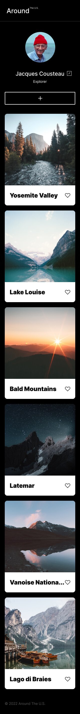

# Project 3: Around The U.S.

The TripleTen Around The U.S. webpage is the third project in the Software Engineer program at TripleTen. It was created using HTML and CSS, based on the provided Figma design. The project is made so all the elements are displayed correctly on popular screen sizes.

## Project features

- Semantic HTML5
- Flexbox
- Grid
- Positioning
- Flat BEM file structure
- Responsive design

### Demo images

#### GitHub Pages

[Link to GitHub Pages!](https://mrgrave84.github.io/se_project_aroundtheus/)
