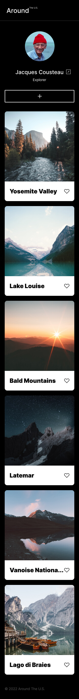

# Project 3: Around The U.S.

This is the third project of the Software Engineering program at TripleTen that runs currently until eighth. It was created using HTML and CSS, based on the provided Figma design brief. Starting from the sixth project JavaScript is being added. This project is made so all the elements are displayed correctly on popular screen sizes.

## Project Features

- Semantic HTML5
- Flexbox
- Grid
- Flat BEM file structure
- Responsive design
- JavaScript
- OOP
- Webpack
- Babel

### Overview

**Figma**

- [Link to the project on Figma](https://www.figma.com/file/ii4xxsJ0ghevUOcssTlHZv/Sprint-3%3A-Around-the-US?node-id=0%3A1)

**Images**

#### GitHub Pages

[Link to GitHub Pages!](https://mrgrave84.github.io/se_project_aroundtheus)

##### Video

[Link to Google Drive!](https://drive.google.com/file/d/11j06IOEjKPDGoO4RMTrRy3e-tnbZ2yzx/view?usp=drive_link)
